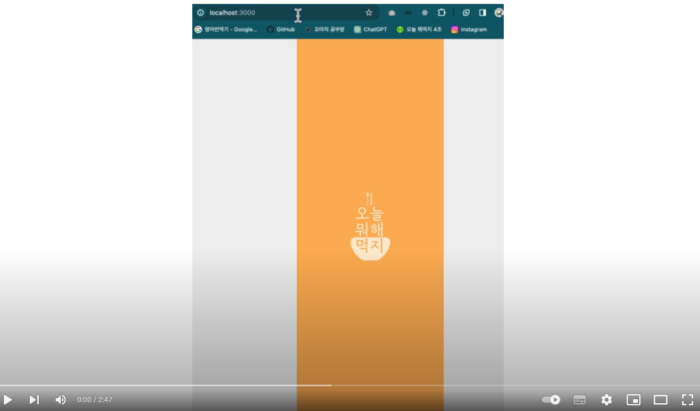

# First - Project 
<h2 style="border-bottom: 1px solid #d8dee4; color: #282d33;"> 오늘 뭐 해 먹지? </h2>  

 
    <h2 style="border-bottom: 1px solid #d8dee4; color: #282d33;"> 앱 소개: "오늘 뭐 해 먹지? </h2>  
    
</li>나만의 레시피 일지를 보관하는 어플입니다.  </li></li>레시피 기록: 매일 새로운 레시피를 시도하고 그 경험을 기록하세요. 요리의 성공과 실패, 새롭게 시도한 요리의 맛, 모든 것을 자유롭게 기록해 보세요. </li></li>사진 첨부: 맛있는 음식을 만들었다면, 그 순간을 사진으로 남겨 자신만의 요리 레시피를 만들어 보세요.  </li></li>저희의 앱은 일상 속 주부 및 자취생들을 타깃으로 오늘 뭐 해 먹지 나만의 레시피 기록일지를 통해 내가 만든 음식들의 목록을 직관적으로 더 쉽게 어디에서든 볼 수 있게 만든 어플입니다.</li> 
 

 
    <h2 style="border-bottom: 1px solid #d8dee4; color: #282d33;"> 시연 동영상 </h2>  
    

 
    <h2 style="border-bottom: 1px solid #d8dee4; color: #282d33;"> 인원 및 파트담당 </h2>  
    
</li>최배근 / 팀장 </li></li>깃허브 관리 및  총 프로젝트 기획 관리 파트: 메인 페이지, 북마크 페이지, 검색, 인트로 </li>
    </li>송가람 / 팀원 </li></li>피그마 기획 이미지 출력 담당 파트: 등록 페이지, 수정 페이지, 피그마 </li>
    </li>박소연 / 팀원 </li></li>기획문서 제작 및 정리 파트: 상세 페이지 및 멤버 페이지, 피그마 </li>
    </li>김경민 / 총괄팀장 </li></li>소통 및 노션에 진행 상태정리 파트: 로그인 페이지, 메인 서브 페이지 </li>
    
 

    <h2 style="border-bottom: 1px solid #d8dee4; color: #282d33;"> 기술 스택 </h2>   
    
 
          
          
          
          
           
          
          
          
          
           
          
          
          

    

    

    <h2 style="border-bottom: 1px solid #d8dee4; color: #282d33;"> 노션 및 링크 주소</h2>   
    
 
      
 
    
 
       
 
    

